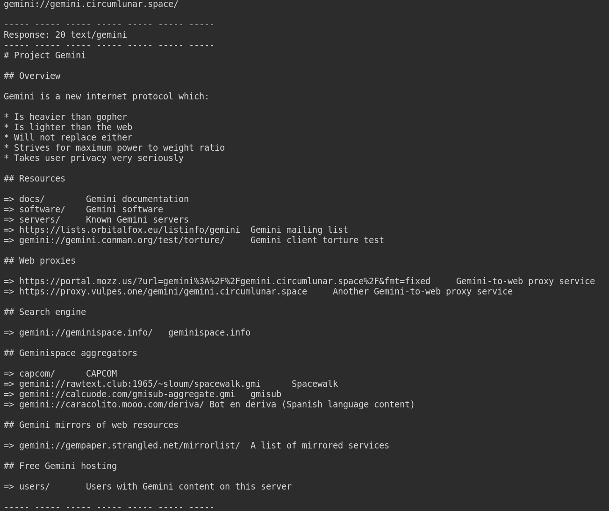

# Project gemini



A simple CLI client for [Gemini protocol](https://gemini.circumlunar.space/), a minimal internet protocol.

## How to use 

### Compile and run Cli client

``` bash
cmake -S . -B build -DCMAKE_BUILD_TYPE=Release
cmake --build build
```

Url needs the schema, like: "gemini://example.org".

``` bash
./build/code/bin/CliClient url port
```

Standard protocol port is 1965.

You can try with some known [urls](https://gemini.circumlunar.space/servers/).


### Run Tests

Test must be activated at compilation time using flag ```-DENABLE_TESTING```.

``` bash
cmake -S . -B build -DCMAKE_BUILD_TYPE=Release -DENABLE_TESTING=ON
cmake --build build 
cmake --build build --target test
```

### Run Sanitizers

There are four type of sanitizers: ```TSAN```, ```ASAN```, ```LSAN``` and ```UBSAN```.
The compilation resets the build path, so you should compile in a different path.

An example with the ```ASAN``` sanitizer:
``` bash
cmake -S . -B build_asan -DCMAKE_BUILD_TYPE=asan -DENABLE_TESTING=ON
cmake --build build_asan
cmake --build build_asan --target test
```

## Bug and todos

* add continuous integration;
* check memory leaks with asan.


## Acknowledgments 

TSL Socket is based on: https://gist.github.com/vedantroy/d2b99d774484cf4ea5165b200888e414